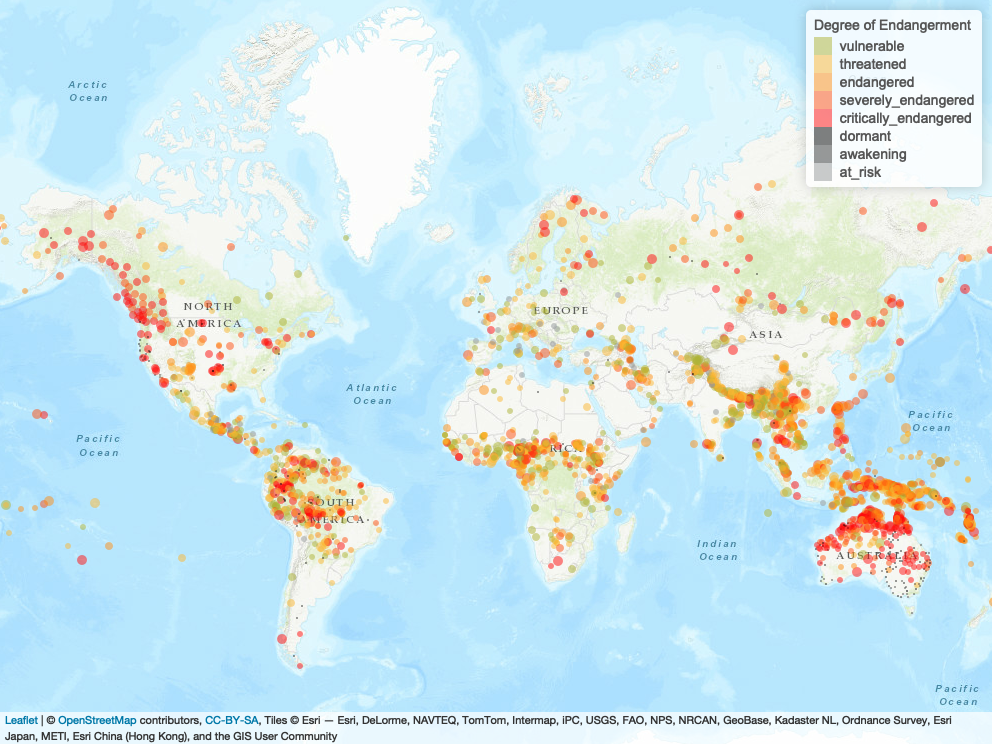

# Repository Structure

📦[CDS_spatial2022](https://github.com/agnesbn/CDS_spatial2022)\
 ┣ 📂[data](https://github.com/agnesbn/CDS_spatial2022/tree/main/data)\
 ┃  (these files will be uploaded on Digital Eksamen and should be added to the `data` folder)\
 ┃ ┗ 📜database_file.csv\
 ┃ ┗ 📂world_administrative-boundaries\
 ┃ ┃ ┗ 📜world_administrative-boundaries.dbf\
 ┃ ┃ ┗ 📜world_administrative-boundaries.prj\
 ┃ ┃ ┗ 📜world_administrative-boundaries.shp\
 ┃ ┃ ┗ 📜world_administrative-boundaries.shx\
 ┣ 📂[output](https://github.com/agnesbn/CDS_spatial2022/tree/main/output)\
 ┣ 📜[clean-up.R](https://github.com/agnesbn/CDS_spatial2022/blob/main/clean-up.R)\
 ┣ 📜[final_project.html](https://github.com/agnesbn/CDS_spatial2022/blob/main/final_project.html)\
 ┣ 📜[final_project.Rmd](https://github.com/agnesbn/CDS_spatial2022/blob/main/final_project.Rmd)\
 ┗ 📜[Spatial_proj_2022.Rproj](https://github.com/agnesbn/CDS_spatial2022/blob/main/Spatial_proj_2022.Rproj)\

# __Report: Hotspots of Endangered Languages__
__Agnes Boel Nielsen -- 201808193__

&nbsp;&nbsp;&nbsp;&nbsp;&nbsp;&nbsp;__Abstract.__ ...

__Keywords__: language endangerment; language revitalisation; language hotspots.

# A. Free text
## 1. Introduction and Goal

## 2. Problems and Background

### 2.1 Language death and language hotspots

### 2.2 The Language Endangerment Index

## 3. Software Framework
I wrote the code for this project on my 1-year old MacBook Air (M1, 2020), 8 GB RAM, which runs macOS Monterey (12.4) operating system. I worked in the desktop version of R (4.1.1) and RStudio (2022.02.3).

## 4. Data Acquisition and Processing

..
| Package  | Version | Reference                      |
|----------|---------|--------------------------------|
| dplyr    | 1.0.9   | Wickham et al., 2022           |
| leaflet  | 2.1.1   | Cheng & Xie, 2022              |
| maptools | 1.1.4   | Bivand & Lewing-Koh, 2022      |
| mapview  | 2.11.0  | Appelhaus et al., 2022         |
| readr    | 2.1.2   | Wickham, Hester & Bryan, 2022  |
| sf       | 1.0.6   | Pebesma, 2018                  |
| spatstat | 2.3.4   | Baddeley, Rubai & Turner, 2015 |
| stringr  | 1.4.0   | Wickham, 2022                  |
| terra    | 1.5.21  | Hijmans, 2022                  |
| tidyr    | 1.2.0   | Wickham & Girlich, 2022        |

  ## 5. Empirical Results
  ### 5.1 Interactive plot with `Leaflet`
  
  
 
 
 ## 6. Critical Evaluation
 
 ## 7. Conclusion
 
 
 ## References 
Anderson, Gregory D. S. (2011). Language Hotspots: what (applied) linguistics and education should do about language endangerment in the twenty-first century. _Language and education_, 25(4), 273–289.

Andres (2021). Error loading a .shp file, using the function "as.owin". _Stack Overflow_. [blog] 3 May. Available at: https://stackoverflow.com/questions/67376532/error-loading-a-shp-file-using-the-function-as-owin [Accessed 5 June 2022].

Amano, Tatsuya, Brody Sandel, Heidi Eager, Edouard Bulteau, Jens-Christian Svenning, Bo Dalsgaard, Carsten Rahbek, Richard G. Davies & William J. Sutherland (2014). Global distribution and drivers of language extinction risk. _Proceedings. Biological sciences/The Royal Society_, 281(1793). https://doi.org/10.1098/rspb.2014.1574.\
Appelhaus, Tim, Florian Detsch, Christoph Reudenbach & Stefan Woellauer (2022). _mapview: Interactive Viewing of Spatial Data in R_. [R package] Available at: https://github.com/r-spatial/mapview [Accessed 5 June 20222].\
Baddeley, Adrian (2010). _Analysing spatial point patterns in R_. Workshop notes, version 4.1, December 2010. University of Western Australia. Available at: https://research.csiro.au/software/wp-content/uploads/sites/6/2015/02/Rspatialcourse_CMIS_PDF-Standard.pdf [Accessed 5 June 2022].\
Baddeley, Adrian, Ege Rubak & Rolf Turner (2015). _Spatial Point Patterns: Methodology and Applications with R_. [R package] Chapman and Hall/CRC Press, London. Available at: https://www.routledge.com/Spatial-Point-Patterns-Methodology-and-Applications-with-R/Baddeley-Rubak-Turner/9781482210200/ [Accessed 5 June 2022].\
Bivand, Roger & Nicholas Lewing-Koh (2022). _maptools: Tools for Handling Spatial Objects_. [R package] Available at: http://maptools.r-forge.r-project.org/, https://r-forge.r-project.org/projects/maptools/ [Accessed 5 June 2022].\
Cheng, Joe, Bhaskar Karambelkar & Yihui Xie (2022). _leaflet: Create Interactive Web Maps with the JavaScript 'Leaflet' Library_. [R package] Available at: https://cran.r-project.org/web/packages/leaflet/index.html, https://rstudio.github.io/leaflet/ [Accessed 5 June 2022].\
Crowley, Terry & Claire Bowern (2010). Language Contact. _An Introduction to Historical Linguistics_. 4th edn. New York: Oxford University Press, pp. 264–298.\
David (2012). Rotating x axis labels in R for barplot. _Stack Overflow_. [blog] 10 August. Available at: https://stackoverflow.com/questions/10286473/rotating-x-axis-labels-in-r-for-barplot [Accessed 5 June 2022].\
Hammarström, Harald, Thom Castermans, Robert Forkel, Kevin Verbeek, Michel A. Westenberg & Bettina Speckmann (2018). Simultaneous Visualization of Language Endangerment and Language Description. _Language Documentation & Conservation_, 12. Honolulu: University of Hawai'i Press, pp. 359–392. Available at: http://hdl.handle.net/10125/24792 [Accessed 2 June 2022].\
Hijmans, Robert J. (2022). _terra: Spatial Data Analysis_. [R package] Available at: https://rspatial.org/terra/ [Accessed 5 June 2022].\
Lee, Nala H. & John R. Van Way (2018). The Language Endangerment Index. In: Campbell, Lyle & Anna Belew, eds. _Cataloguing the World’s Endangered Languages_, 1st  edn. London: Routledge, pp. 66–78. Available at: http://doi.org/10.4324/9781315686028. \
Pebesma, Edzer (2018). Simple Features for R: Standardized Support for Spatial Vector Data. _The R Journal_, 10(1), pp. 439-446 [R package]. Available at: https://doi.org/10.32614/RJ-2018-009 [Accessed 5 June 2022].\
Tobler, Waldo (1970) “A computer movie simulating urban growth in the Detroit region”. _Economic Geography_, 46(2): 234-240.\
Wickham, Hardley (2022). _stringr: Simple, Consistent Wrappers for Common String Operations_. [R package] Available at: http://stringr.tidyverse.org, https://github.com/tidyverse/stringr [Accessed 5 June 2022].\
Wickham, Hardley, Jim Hester & Jennifer Bryan (2022). _readr: Read Rectangular Text Data_. [R package] Available at: https://readr.tidyverse.org, https://github.com/tidyverse/readr [Accessed 5 June 2022].\
Wickham, Hardley, Maximillian Girlich (2022). _tidyr: Tidy Messy Data_. [R package] Available at: https://tidyr.tidyverse.org, https://github.com/tidyverse/tidyr [Accessed 5 June 2022]\
Wickham, Hardley, Romain François, Lionel Henry & Kirill Müller (2022). _dplyr: A Grammar of Data Manipulation_. [R package] Available at: https://dplyr.tidyverse.org, https://github.com/tidyverse/dplyr [Accessed 5 June 2022].\

 
 # B. Required Metadata
 ## Table 1 - Software Metadata
 
 
 ## Table 2 - Data Metadata
 
 
 # Appendix I: Aggregated table of _LEI_ factors
The table below show the description associated with each rank (0–5) for the four factors used by the Language Endangerment Index to assess the endangerment status of a language. The table is an aggregated form of tables 5.1–5.4 provided by Lee & Van Way (2018: 68, 69, 70).

 
 
 
 
